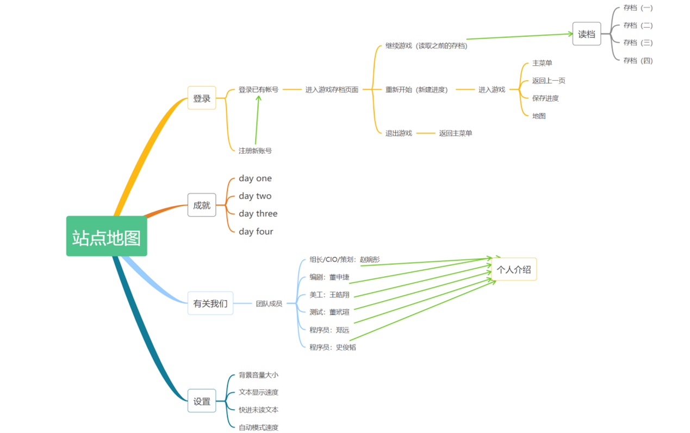

🎮 **Rusting：悬疑解谜文字冒险游戏**

📘 **项目介绍**
本项目是北京理工大学大二上小学期 Web 开发课程的实践作品。

受到中国本土题材的恐怖悬疑解谜游戏——《烟火》和密室逃脱类游戏系列——《Cube Escape》的启发，我们决定制作一款交互性优良、剧情引人入胜的悬疑解谜类游戏。通过刺激的恐怖情节和精细有深意的剧情，带给玩家沉浸式的体验。

Rusting 是集恐怖、解密、多结局于一体的剧情向文字冒险游戏，采用 galgame 的文字交互形式。

站点地图：

游戏入口：

🎮 **游戏特色**
内置 mini game，丰富游戏内容

设置存档系统，不同选择触发不同结局

多存档机制便于玩家体验和解锁多种结局

🛠 **项目技术**
开发平台：VS Code

运行平台：Windows 10、Windows 11

核心技术：HTML、CSS、JavaScript

🔧 **技术实现细节**
使用 document.getElementById 获取用户输入的用户名和密码

使用 localStorage.getItem 将用户名和密码存储到浏览器的本地存储中

登录时通过与 localStorage 中的数据匹配实现验证

📱**响应式设计**
使用 CSS 媒体查询适配不同设备

引入 Bootstrap 组件和 jQuery 完善网站的响应式体验

🧠 **可用性与调试**
编写详尽的逻辑图，确保程序逻辑清晰无误

每完成一部分代码后进行网页调试

通过浏览器控制台监控变量值和函数执行情况，定位并解决 bug
